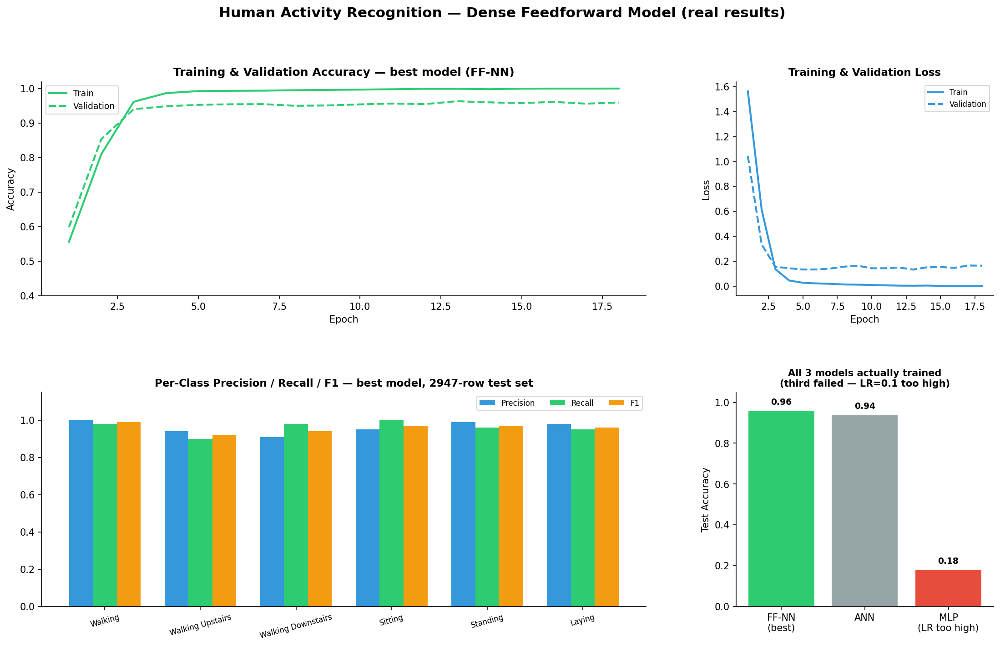
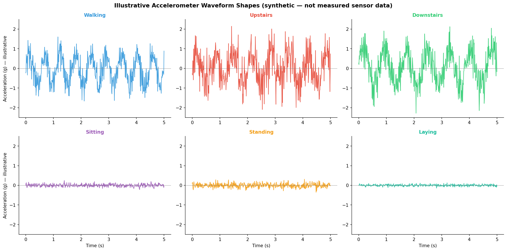

# Human Activity Recognition — Dense Neural Network Comparison
[](https://python.org)
[](https://www.tensorflow.org)
[]()

## Business Problem

> *Wearable sensors generate continuous streams of movement data — but classifying what a person is doing in real time requires models that can separate overlapping, similar-looking movement signatures.*

This project classifies 6 human activities (walking, walking upstairs/downstairs, sitting,
standing, laying) from the UCI-HAR dataset's pre-extracted, 561-dimension feature vectors
(561 hand-engineered features per 128-sample sensor window — not raw accelerometer/gyroscope
signal). Three dense feedforward architectures are trained and compared.

**This repo does not currently contain a CNN or LSTM model** — despite the earlier repo name.
All three trained models are `Dense`-layer feedforward networks operating on the pre-extracted
feature vectors, not raw time-series windows (a CNN/LSTM would need the latter). Adding a real
Conv1D/LSTM model over raw windowed sensor data is a natural next step — see Roadmap below — but
isn't done here yet.

## Key Outputs



*Chart above is generated directly from this repo's real notebook run — see
"Reproducing these numbers" below.*



*This second chart is illustrative synthetic waveforms showing what each activity's signal
roughly looks like — it is not measured sensor data. UCI-HAR ships pre-extracted features, not
raw waveforms, so no real per-timestep signal exists in this repo to plot.*

## Model Results (real, from the notebook's actual test-set evaluation)

| Model | Test Accuracy | Notes |
|-------|--------------|-------|
| **FF-NN (best)** | **96%** | Dense layers, standard learning rate — best result |
| ANN | 94% | Dense layers, slightly different architecture |
| MLP | 18% | Learning rate set to 0.1 — too high, model never converges (collapses to predicting one class) |

The 18% result is a real, documented training failure, not an error in this table — it's kept
here because "what happens when the learning rate is too high" is a genuine, useful result from
the notebook's own model-comparison experiment.

Per-class precision/recall/F1 for the best model (2,947-row held-out test set):

| Activity | Precision | Recall | F1 |
|---|---|---|---|
| Walking | 1.00 | 0.98 | 0.99 |
| Walking Upstairs | 0.94 | 0.90 | 0.92 |
| Walking Downstairs | 0.91 | 0.98 | 0.94 |
| Sitting | 0.95 | 1.00 | 0.97 |
| Standing | 0.99 | 0.96 | 0.97 |
| Laying | 0.98 | 0.95 | 0.96 |

## Architecture (what's actually implemented)

```
UCI-HAR pre-extracted features (561 features × 10,299 windows)
        ↓
StandardScaler + label encoding + PCA
        ↓
    ┌──────────────────────────────┐
    │   Dense(128) → Dropout       │
    │   Dense(64)  → Dropout       │
    │   Dense(6, softmax)          │
    └──────────────┬───────────────┘
                   ↓
          Activity Classification
      (Walking / Sitting / Standing / ...)
```

## Roadmap (not yet implemented)

- Add a real `Conv1D`→`LSTM` model trained on raw windowed accelerometer/gyroscope signal
  (requires the raw UCI-HAR `Inertial Signals` files, not the pre-extracted feature set used
  here) — this would make the CNN+LSTM framing accurate.
- Until then, the repo name/description should be read as "dense-network baseline", not
  "CNN+RNN pipeline."

## Dataset

| Source | Details |
|--------|---------|
| [UCI-HAR](https://archive.ics.uci.edu/ml/datasets/human+activity+recognition+using+smartphones) | 10,299 windows, 561 pre-extracted features, 6 activity classes — this is what the notebook actually loads and trains on |

## Quickstart

```bash
git clone https://github.com/Shreya-Macherla/Human-Activity-Recognition-using-CNN-and-RNN
cd Human-Activity-Recognition-using-CNN-and-RNN
pip install -r requirements.txt

python har_analysis.py             # regenerates the two charts above from the real numbers below
jupyter notebook "HAR_Neural Sample code.ipynb"   # full training notebook (source of the real numbers)
```

## Reproducing these numbers

Every number in this README and in `outputs/01_model_performance.png` was copied directly from
`HAR_Neural Sample code.ipynb`'s own executed cell outputs — open the notebook and check cells
46, 58, 69, 70, 75–78 to see the same accuracy/loss/classification-report values printed live
during training. `har_analysis.py` does not simulate or invent any of this data; it only
re-plots numbers that are already in the notebook.

## Repository Structure

```
Human-Activity-Recognition-using-CNN-and-RNN/
├── har_analysis.py                  # Re-plots the notebook's real results as charts
├── HAR_Neural Sample code.ipynb     # Full training and evaluation notebook (source of truth)
├── outputs/
│   ├── 01_model_performance.png     # Real training curves, per-class metrics, model comparison
│   └── 02_sensor_patterns.png       # Illustrative waveform shapes (not measured data)
├── requirements.txt
└── README.md
```

## Tools

`Python 3.8` `TensorFlow` `Keras` `scikit-learn` `Matplotlib` `PCA`
